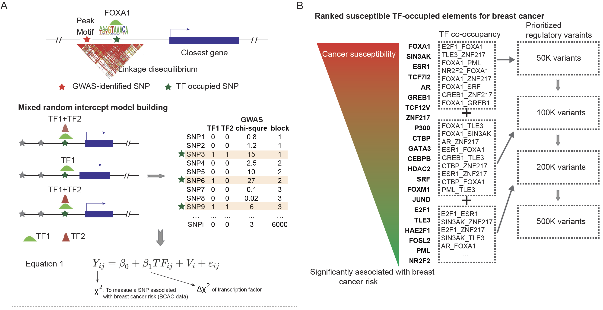

## Users’ Manual of sTF-TWAS

## Overview
Transcriptome-wide association studies (TWAS) have successfully uncovered many putative disease susceptibility genes. However, TWAS may suffer from inaccuracy of gene expression predictions due to inclusion of non-regulatory variants. By integrating prior knowledge of susceptible transcription factor (sTF)-occupied elements, we develop sTF-TWAS and demonstrate that it outperforms existing TWAS approaches in both simulation and real data analyses. Under the sTF-TWAS framework, we build genetic models to predict tissue-specific alternative splicing (sp) and gene expression in normal breast, prostate and lung tissues from the Genotype-Tissue Expression (GTEx) project and applied these models to data from large genome-wide association studies (GWAS) conducted among European-ancestry populations. At Bonferroni-corrected P < 0.05, we identify 354 putative susceptibility genes, including 189 previously unreported in GWAS-identified risk loci and 45 genes (17 for breast; 12 for prostate; and 16 for lung) in novel loci. These findings provide additional insight into the genetic susceptibility of these common cancers. 

## Methods
### Elastic-Net training: 
### 1. Prepare input data: 

**1)	Gene expression file:** \
Take the prostate cancer as an example. The fully processed, filtered and normalized gene expression matrices in bed format ("Prostate.v8.normalized_expression.bed") for prostate tissue was downloaded from GTEx portal (https://gtexportal.org/home/datasets). We included 221 samples in our analysis and removed sex chromosomes, by which we generated a new file named "Prostate.v8.normalized_expression.no_sex.bed". The covariates used in eQTL analysis, including top five genotyping principal components (PCs), were obtained from GTEx_Analysis_v8_eQTL_covariates.tar.gz, which was downloaded from GTEx portal (https://gtexportal.org/home/datasets). Then, we further performed a probabilistic estimation of expression residuals (PEER) analysis to adjust for top five genotyping PCs, age, and other potential confounding factors (PEERs)[1] for downstream prediction model building. There is a description of how to download and use the PEER tool here: https://github.com/PMBio/peer/wiki/Tutorial. The command that we used is shown as below: 

`Rscript ./code/Peer_Script.R`

According to the GTEx protocol, if the number of samples is between 150 and 250, 30 PEER factors should be used. For our study, the number of samples is 221, so we used 30 PEER factors. This command will generate a residual file named “GeneExpression_Prostate_AfterRM_Residuals.csv”, and from this residual file, we generated the final gene expression data file named “Prostate.v8.normalized_expression.no_sex.rm_covariates.bed” as the input for our downstream predictive model. 

**2)	genotype file:**  
The whole genome sequencing file, GTEx_Analysis_2017-06-05_v8_WholeGenomeSeq_866Indiv.vcf, was downloaded from dbGaP (https://www.ncbi.nlm.nih.gov/projects/gap/cgi-bin/study.cgi?study_id=phs000424.v8.p2). The genotype dataset is quality controlled using the tool PLINK [2] (https://zzz.bwh.harvard.edu/plink/ ). Multiple QC steps were applied by excluding variants with missingness rate > 0.1, minor allele frequency < 0.01, high deviations from Hardy-Weinberg equilibrium at p<10-6, and removing samples with missingness rate > 0.1.

Take the prostate cancer as an example. We prioritized putative regulatory variants based on their associations with prostate cancer risk. For variants that bind to only one TF, we used the single TF beta value, and for other variants that bind to more than one TFs, we considered the largest beta values of the paired TFs. Once we obtained the beta values for all TF-occupied elements, we ranked those variants based on the beta values from largest to smallest, which illustrated with more important to less for prostate cancer risk. We then compiled four sets of putative regulatory variants by roughly including top 50K, 100K, 200K and 500K regulatory variants. 

The tissue specific input genotype file ("genotype_file") with the format as below:

 CHR,LOC,GTEX-111CU,GTEX-111FC,GTEX-111YS,GTEX-117YW,GTEX-117YX, … … \
 1,933303,0,0,0,0,0,0,0,0,1,0,0,0,1,0,0,0,0,0,0,0,0,0,0,0,0,0,0,0,0,0,0,0, … … \
 1,933411,1,2,2,2,2,2,2,2,2,2,2,2,1,2,2,2,2,2,2,2,2,2,2,2,2,2,2,2,2,2,2,2,2, … … \
 1,933653,0,0,0,0,0,0,0,0,0,0,0,0,0,0,0,0,0,0,0,0,0,0,0,1,0,0,0,0,0,1,0,0,0, … … \
 … …

The input genotype file for calculating covariance ("covariance_genotype_file") should be non-tissue specific, with the same format as the tissue specific input genotype file.

**3)	SNP annotation file:** \
The input snp annotation file ("snp_annot_file"), contains only the top 50K, 100K, 200K and 500K regulatory variants with the format as below: 

SNP,varID,chr,pos,ref,effect \
rs1578391,chr1_629906_C_T_b38,1,629906,C,T \
rs6594029,chr1_630026_C_T_b38,1,630026,C,T \
rs114983708,chr1_778639_A_G_b38,1,778639,A,G \
rs71507461,chr1_827209_G_C_b38,1,827209,G,C \
rs71507462,chr1_827212_C_G_b38,1,827212,C,G \
… …

**4)	Gene annotation file:** \
The input gene annot file ("gene_annot_file") is downloaded from GENCODE: https://www.gencodegenes.org/human/release_26.html, in the GTF format and build in GRCh38.

**5)	GWAS file:** \
The input GWAS file ("gwas_file") contains "chr" and "position" columns, we just need to make sure that all the SNPs being trained in the Elastic Net model can be found in the GWAS dataset.

### 2. Training Elastic Net model:
For each regulatory variant set, we trained the gene-expression prediction model using an elastic-net approach. However, instead of using all flanking genetic variants (flanking ±1Mb region) to train the elastic-net model, like the regular TWAS does, we only included the putative regulatory variants in each set within flanking ±1Mb region of the target gene. For each gene, the gene expression level was regressed on the number of effect alleles (0-2) for each genetic variant with adjustment for top genotyping PCs, age, and other potential confounding factors (PEERs). 

We processed one chromosome at a time by executing this code, take chromsome 1 as an example:\
`Rscript ./code/sTF_TWAS.R  1`

### References: 
1. Stegle, O., Parts, L., Piipari, M., Winn, J., and Durbin, R. (2012). Using probabilistic estimation of expression residuals (PEER) to obtain increased power and interpretability of gene expression analyses. Nat Protoc 7, 500-507.
2. Purcell, S., Neale, B., Todd-Brown, K., Thomas, L., Ferreira, M.A., Bender, D., Maller, J., Sklar, P., de Bakker, P.I., Daly, M.J., et al. (2007). PLINK: a tool set for whole-genome association and population-based linkage analyses. Am J Hum Genet 81, 559-575.

### Contacts
  Jingni He: jingni.he1@ucalgary.ca 
  Quan Long: quan.long@ucalgary.ca 
  Xingyi Guo: xingyi.guo@vumc.org 
